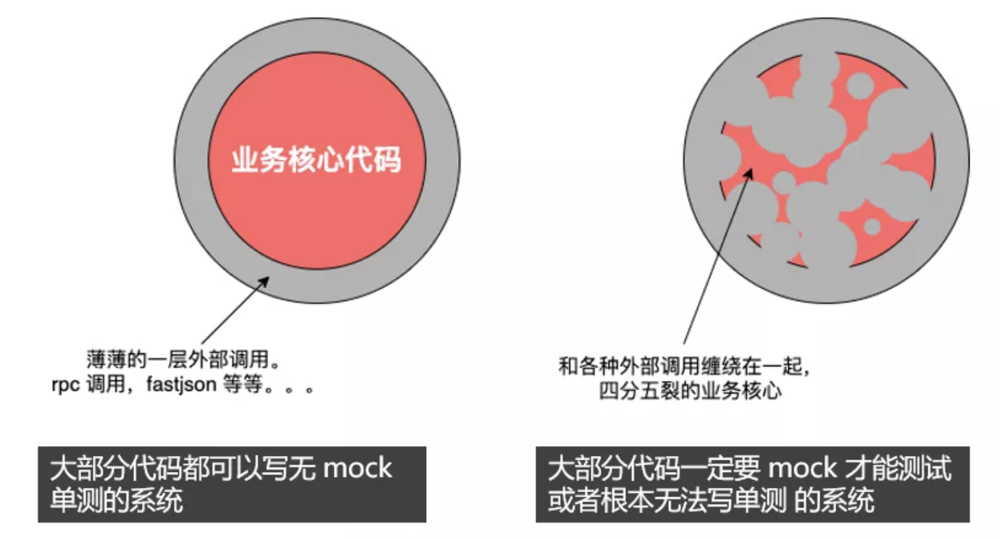

<!-- TOC -->

- [什么是单元测试，单元测试测的是什么？](#什么是单元测试单元测试测的是什么)
  - [测试稳定的业务逻辑](#测试稳定的业务逻辑)
- [单元测试带来的好处](#单元测试带来的好处)
- [几种单元测试风格](#几种单元测试风格)
- 
- [参考资料](#参考资料)

<!-- /TOC -->

## 什么是单元测试，单元测试测的是什么？

### 测试稳定的业务逻辑

业务核心代码才是单元测试真正起作用的场景，因为它是比较稳定的业务逻辑，只需要传几个参数进去，然后校验一下返回值就行了。而针对于外部调用的不稳定性，理论上不写单测也无所谓，即使你跟对方约定好了出入参数，他依旧有可能返回不符合约定的参数，或者直接就发生了网络错误，这一部分是集成测试发挥的场景。

在实际的项目中，之所以觉得单测无用，是因为编写的代码本身大都是外部调用，业务逻辑代码没有很好的内聚性，单测不能真正发挥其本身的作用。

## 单元测试带来的好处

## 几种单元测试风格

## 

## 参考资料
- [阿里技术-单元测试难？来试试这些套路](https://mp.weixin.qq.com/s/TjJ31yWTMwr4szz1JqtKcQ)
- [阿里技术-单元测试，只是测试吗？](https://mp.weixin.qq.com/s/nIntjcrhgLQMiNo0XqPyyg)